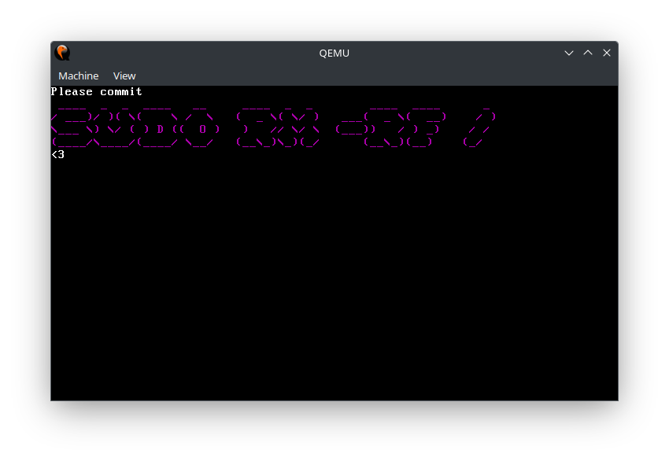

# sudo rm OS
With state of the art VGA Graphics and Multiboot 2 headers, this OS can give you the best way to commit `sudo rm -rf /`!

## Credits
Assembly code provided by [CodePulse](https://github.com/davidcallanan) from his [Operating System Tutorial](https://github.com/davidcallanan/os-series)

## Prerequisites
- [GNU Compiler Collection](https://gcc.gnu.org/)
- [NASM](https://www.nasm.us/)
- [xorriso](https://www.gnu.org/software/xorriso/)
- [QEMU](https://www.qemu.org/)
- [mtools](https://www.gnu.org/software/mtools/)
- grub-common

## Resources
- [OSDev Wiki](https://wiki.osdev.org/Main_Page) (ig)

## Help
If you have any question, feel free to [open an issue](https://github.com/averyocean65/sudo-rm-os/issues/new)! (if your issue is that you got pissed over me telling you to delete your whole linux filesystem)

## Reviews
> A truly unique experience
- me

> Why the fuck did you make this
- also me

> WAAAAAH NOOOO :<<<<<<
- person on twitter

> I followed the instructions shown by the OS and it changed my life
- someone i know
